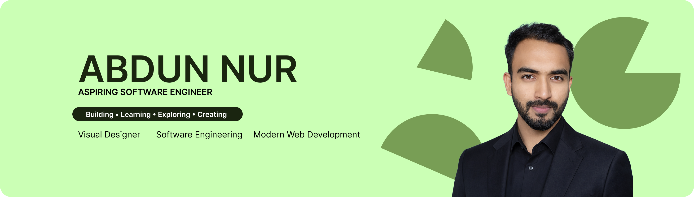

<!-- ===================================================== -->

<!--                         BANNER                         -->

<!-- ===================================================== -->

  

<!-- ===================================================== -->

<!--                         INTRO                          -->

<!-- ===================================================== -->

<h1 align="center">Hi, I'm Abdun Nur 👋</h1>

<h3 align="center">Full-Stack Designer • Aspiring Software Engineer</h3>

  <b>Designing • Coding • Building • Exploring</b>

  I bridge the gap between <b>design and development</b> by creating
  modern, functional, and visually engaging digital experiences.

  

  

  

  

  

<!-- ===================================================== -->

<!--                       ABOUT ME                         -->

<!-- ===================================================== -->

## About Me

I'm a **Full-Stack Designer and aspiring Software Engineer** focused on combining creative design thinking with modern software development.

I enjoy transforming ideas into polished digital products — from **visual concepts and UI design to functional web applications and backend systems**.

### Currently

* 🎨 Designing **modern UI/UX & digital experiences**
* 🌱 Exploring **Next.js, TypeScript & Node.js**
* 💻 Building **full-stack web applications**
* 📚 Learning **software engineering & backend development**
* 🔌 Exploring **APIs, databases & full-stack architecture**
* 🚀 Turning ideas into **real-world products**

<!-- ===================================================== -->

<!--                    DESIGN + CODE                       -->

<!-- ===================================================== -->

## Design + Development

### Creative Tools

  

### Development

  

  
    Graphic Design • Branding • UI/UX • Motion Graphics • Video Editing • 3D • Illustration • Frontend • Backend • Full-Stack
  

<!-- ===================================================== -->

<!--                    TECHNOLOGIES                       -->

<!-- ===================================================== -->

## Technologies

### Languages

  
  
  
  
  
  
  
  
  
  

### Frontend

  
  
  
  
  
  
  
  
  

### Backend & APIs

  
  
  
  
  
  
  
  

### Databases

  
  
  
  
  

### Stacks

  

### Design & Creative

  
  
  
  
  
  
  

### Tools, DevOps & Workflow

  
  
  
  
  
  
  
  
  

### AI & Engineering

  
  
  
  

<!-- ===================================================== -->

<!--                   WHAT I DO                           -->

<!-- ===================================================== -->

## What I Do

<table>
<tr>

<td width="33%" align="center">

### 🎨 Design

UI/UX Design
Brand Identity
Visual Design
Social Media Graphics
Motion Graphics

</td>

<td width="33%" align="center">

### 💻 Development

Frontend Development
Backend Development
Full-Stack Applications
REST APIs
Database Integration

</td>

<td width="33%" align="center">

### 🚀 Build

Creative Products
Web Applications
Interactive Interfaces
Digital Experiences
Real-World Projects

</td>

</tr>
</table>

<!-- ===================================================== -->

<!--                  FEATURED PROJECTS                     -->

<!-- ===================================================== -->

## Featured Projects

<table>
<tr>

<td width="50%">

<h3 align="center">FitLog</h3>

  

  Fitness tracking web application built with modern web technologies.

  

</td>

<td width="50%">

<h3 align="center">More Projects</h3>

  Explore my GitHub repositories to see what I'm currently building and learning.

  

</td>

</tr>
</table>

<!-- ===================================================== -->

<!--                    Work Experience                   -->

<!-- ===================================================== -->
💼 Work Experience
🎨 The North Pole — Graphic Designer

Mar 2025 – Aug 2026

Created visual assets for digital and marketing campaigns, including social media graphics, promotional designs, and branded content.
Designed engaging visual materials while maintaining brand consistency and professional design standards.
Collaborated with team members to develop creative solutions for various design requirements.
💻 Freelance — Visual Designer & Web Developer

2023 – Present

Designed logos, branding materials, social media graphics, thumbnails, posters, advertisements, and other digital assets for clients.
Developed responsive and user-friendly websites using modern frontend technologies.
Combined visual design and development skills to create cohesive digital experiences from concept to implementation.
🖥️ Personal & Open-Source Projects

2024 – Present

Building full-stack web applications while continuously expanding software engineering skills.
Working with technologies including HTML, CSS, JavaScript, TypeScript, React, Next.js, Node.js, Express.js, MongoDB, and Tailwind CSS.
Focused on writing maintainable code, developing responsive interfaces, and integrating modern web technologies.

<!-- ===================================================== -->

<!--                    GITHUB ACTIVITY                    -->

<!-- ===================================================== -->

## GitHub Activity

  

  
  

  
  

  
  

<!-- ===================================================== -->

<!--                  CONTRIBUTION STREAK                   -->

<!-- ===================================================== -->

## Contribution Streak

  

<!-- ===================================================== -->

<!--                     CURRENT FOCUS                      -->

<!-- ===================================================== -->

## Current Focus

`Full-Stack Development`
  •  
`TypeScript`
  •  
`Next.js`
  •  
`Node.js`
  •  
`UI/UX`
  •  
`Software Engineering`

<!-- ===================================================== -->

<!--                     CONNECT                           -->

<!-- ===================================================== -->

## Connect With Me

  

  

  

  

  

---

<!-- ===================================================== -->

<!--                        FOOTER                          -->

<!-- ===================================================== -->

  <i>Concept • Code • Create • Commit</i>

  Built with curiosity, creativity & code.

   
  

